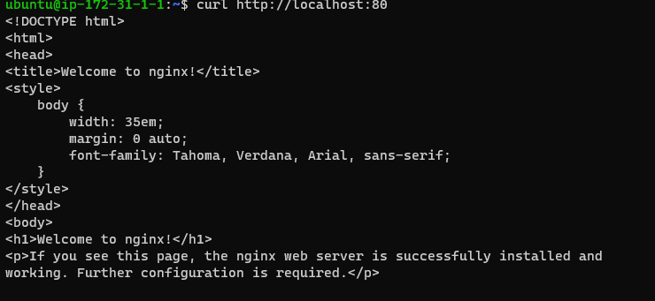

## PROJECT 2: LEMP STACK IMPLEMENTATION

### WEB STACK IMPLEMENTATION (LEMP STACK)

### STEP 1 – INSTALLING THE NGINX WEB SERVER

### In order to display web pages to our site visitors, we are going to employ Nginx, a high-performance web server. We’ll use the apt package manager to install this package.

`sudo apt update`

`sudo apt install nginx`

### To verify that nginx was successfully installed and is running as a service in Ubuntu

`sudo systemctl status nginx`

### access it locally and from the Internet (Source 0.0.0.0/0 means ‘from any IP address’).

`curl http://localhost:80`

### STEP 2 — INSTALLING MYSQL

`sudo apt install mysql-server`

### STEP 3 – INSTALLING PHP

### While Apache embeds the PHP interpreter in each request, Nginx requires an external program to handle PHP processing and act as a bridge between the PHP interpreter itself and the web server. This allows for a better overall performance in most PHP-based websites, but it requires additional configuration. You’ll need to install php-fpm, which stands for “PHP fastCGI process manager”, and tell Nginx to pass PHP requests to this software for processing. Additionally, you’ll need php-mysql, a PHP module that allows PHP to communicate with MySQL-based databases. Core PHP packages will automatically be installed as dependencies.

`sudo apt install php-fpm php-mysql`

### Step 4 — Configuring Nginx to Use PHP Processor

### When using the Nginx web server, we can create server blocks (similar to virtual hosts in Apache) to encapsulate configuration details and host more than one domain on a single server. In this guide, we will use projectLEMP as an example domain name.

On Ubuntu 20.04, Nginx has one server block enabled by default and is configured to serve documents out of a directory at /var/www/html. While this works well for a single site, it can become difficult to manage if you are hosting multiple sites. Instead of modifying /var/www/html, we’ll create a directory structure within /var/www for the your_domain website, leaving /var/www/html in place as the default directory to be served if a client request does not match any other sites.

`sudo mkdir /var/www/projectLEMP`

### STEP 5 – TESTING PHP WITH NGINX

